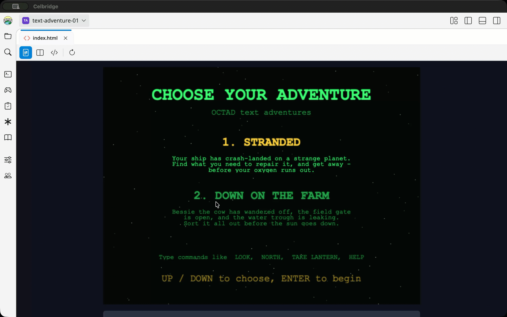
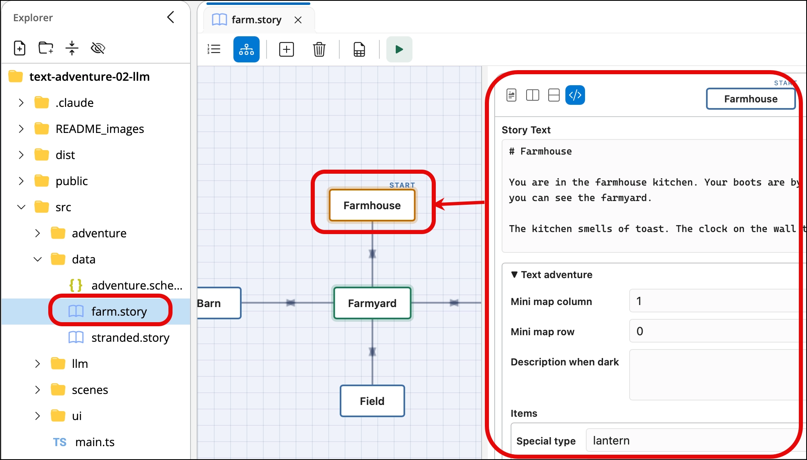

# Matt's OCTAD text adventures

OCTAD = **O**pen **C**ollege **T**ext **AD**venture
- made with the [Celbridge](https://www.celbridge.org/) game toolks workbench
- this repo is an open-source Celbridge project ready to download, run and mod ...

**[▶ Play it in your browser](https://dr-matt-smith.github.io/text-adventure-02-llm/dist/)** - no download or build needed (the free-text LLM help needs [LM Studio](https://lmstudio.ai/) running on your own computer; see below).

Text adventures in Phaser 4 and TypeScript, based on Matt's  OCTAD college student starter game from around 2015 (originally Unity C#).




This versions links to a local LLM (if available), allowing free text entry, but no extra help such as multi-action plans etc. It just means the user can type free text, and either get an answer from the LLM about locations/descriptions the user has already seen, or their text is converted to one of the simple text commands permitted by the game parser.
- performance on a 32Gb 2026 M5 MacBook Air is acceptabled, the agaent responding within a couple of seconds 
- if I close everything other application of course :-)
- I was using the [qwen/qwen3.6-35b-a3b](https://huggingface.co/Qwen/Qwen3.6-35B-A3B) model runing in [LM Studio](https://lmstudio.ai/)

This project is also a nice example of the Command pattern
- for students who are learning about OO Design Patterns ....

## Choice of 2 games

The start screen lets you choose between two games:

- **Stranded** - your ship has crash-landed. Explore the planet, find a power cell and a tool to
  fit it, and get back to your ship to REPAIR it - before your oxygen runs out.
- **Down on the Farm** - Bessie the cow has wandered off. Bring her back to the field, CLOSE the
  gate, and find a wrench to FIX the leaking water trough - before the sun goes down.

Both games run on the same engine; each one is a `Story` (see below).


## Controls

On the start screen, pick a game with UP / DOWN (or 1, 2, or the mouse) and press ENTER. Then
click the game, type commands and press ENTER. UP and DOWN bring back earlier commands.

| Command | Does |
|---|---|
| `look` (`l`) | describe where you are |
| `north`, `south`, `east`, `west` (`n`, `s`, `e`, `w`, `go north`) | walk that way |
| `take <item>` (`get`, `pickup`) | pick something up - `take the power cell` and `take cell` both work |
| `drop <item>` | put something down |
| `examine <item>` (`x`) | look closely at something |
| `inventory` (`i`) | list what you are carrying |
| `repair` | Stranded: fix the ship (in the ship, with the right things) |
| `close <thing>` (`shut`) | Farm: close something - `close gate` |
| `fix <thing>` (`repair`, `mend`) | Farm: mend something - `fix trough` |
| `help` | list the commands |
| `quit` | give up |

## Typing in your own words (with a local LLM)

If [LM Studio](https://lmstudio.ai/) is running on this computer, you can type in your own words, and an LLM helps - one
turn at a time:

- *"pick up the lamp"* - the LLM turns it into **one** command (shown as `= take lantern`), and the
  game does it, just as if you had typed it.
- *"where was the cow?"*, *"how do I get back to the ship?"* - the LLM **answers** (in blue, marked
  `(LLM)`) from what you have seen. Nothing changes in the game.

It never does more than one command, and never moves you more than one place: *"go back to the
ship"* gets you the directions, and you type each step.

1. In LM Studio, load the model (`qwen/qwen3.6-35b-a3b`).
2. Start its server with CORS on: the speech-bubble button in the console runs
   `~/.lmstudio/bin/lms server start --cors`. (Without CORS the browser won't let the game page talk
   to it. CORS lets any website use the server, so stop it when you're done:
   `~/.lmstudio/bin/lms server stop`.)
3. Play as usual. Plain commands (`take lantern`, `n`, `look`) still go straight to the game, with no
   LLM; anything else takes a second or two.

If the server isn't running, the game says so and carries on with its own commands. To turn the LLM
off, or use another model, or Ollama instead, change the settings at the top of `src/llm/LmStudio.ts`.

**How it works, and what it can't do, is in [README_LLM_design.md](README_LLM_design.md).**

## How it is built

The game is in two halves that never mix:

- `src/adventure/` - **the game itself, in plain TypeScript.** Text in, text out. No Phaser at
  all, so it can be unit tested without a browser (`deno task test`).
- `src/ui/` and `src/scenes/` - **the screen**, in Phaser. It shows the text and reads the
  keyboard, and has no game rules in it.

This is the MODEL / VIEW split from MVC: you could put the same adventure behind a console, a web
form or a chat bot and not change a line of it.

```
adventure/
  Adventure           the game: process(text) -> reply; Playing / Won / Lost / Quit
  stories/Story       an interface: what makes one adventure different from another
  ├── Stranded        the world, words, REPAIR command and ending for Stranded
  └── Farm            the same for Down on the Farm, plus checkForWin(): all three jobs done?
  StoryFile           reads a story (src/data/*.story) into the data World builds itself from
  World               builds the world: locations, exits and items (the Unity Map class)
  Location            descriptions, exits (a Map<Direction, Location>), items
  └── DarkLocation    overrides getDescription() and getVisibleItems(): you need a light
  Player              where you are, inventory, time left (oxygen / daylight), moves
  Direction           NORTH / SOUTH / EAST / WEST - a Java-style enum class
  CommandParser       "  TAKE the Power Cell" -> verb "take", noun "power cell", a Command
  Memory              what the player has seen in each place, as they last saw it
  Translator          free text -> ONE command, or an answer, by asking an LLM (given to it as a function)
  items/Item          name, description, matches(), givesLight(), onTake(), onDrop(), close(), fix()
  ├── Lantern         overrides givesLight()
  ├── OxygenTank      overrides onTake() and getDescription()
  ├── Cow             overrides onTake() and onDrop(): you lead her, not carry her
  └── Fixture         overrides canBeTaken(): it stays where it is
      ├── Gate        overrides close()
      └── Trough      overrides fix(): needs the wrench
  commands/Command (abstract)     the COMMAND PATTERN: one class per command
  ├── LookCommand, GoCommand, TakeCommand, DropCommand, ExamineCommand,
  ├── InventoryCommand, HelpCommand, QuitCommand     (in every story)
  └── RepairCommand (Stranded), CloseCommand, FixCommand (Farm)

data/
  stranded.story, farm.story   each story, written in the Story Builder: locations, exits, items, words
  adventure.schema.json        the extra fields an adventure's story and locations have (map position, items...)

ui/
  Terminal            extends Container: scrolling text
  InputLine           extends Text: typing, a blinking cursor and command history
  StatusPanel         HAS texts and a Graphics: location, oxygen / daylight bar, moves, inventory
  MiniMap             extends Container: the places you have been, drawn as you explore

llm/
  LmStudio            asks the LLM in LM Studio (its settings are at the top)

scenes/
  StartScene (choose a story) -> GameScene -> EndScene
```

## From the Unity version

| Unity (C#) | Here (TypeScript) | What changed |
|---|---|---|
| `MyGameManager.ProcessSingleWordUserCommand` - a big `switch` | `commands/*Command.ts` | the Command pattern: each command is its own class |
| `CommandParser` with three `@TODO`s | `CommandParser.ts` | does the TODOs (lower case, trim, squash spaces), and two-word commands work |
| `Location.exitNorth` / `exitSouth` / ... | `Location.exits`, a `Map<Direction, Location>` | `connect()` joins two places both ways at once |
| `Location.firstVisit` | `Location.visits` | first description first, then a random one - as before |
| `Map` | `World` | renamed: JavaScript already has a `Map` |
| `PickUp` (empty) | `Item`, `Lantern`, `OxygenTank` | finished, with subclasses |
| `Player.oxygenLevel` (unused) | `Player.timeLeft` | now it is the clock (oxygen, or daylight on the farm) |
| `Util.Command`, `Util.Noun` enums | `Direction` class, `GameState` enum | |
| `Tester.cs` | `tests/Adventure.test.ts` | real unit tests |

The Unity project had no pictures, sounds or font of its own, so neither does this: everything is
text, or drawn with Graphics.

## What to look at

- `src/adventure/commands/Command.ts` and any one command - the **Command pattern**. Adding a
  command is one new class plus one line in `Adventure`'s list. `HelpCommand` asks every command
  for its own help text, so it never needs changing.
- `src/adventure/DarkLocation.ts` - overriding two **protected** methods changes how the
  **inherited** `describe()` and `findItem()` behave (the template method pattern).
- `src/adventure/Player.ts` `hasLight()` - asks every item `givesLight()`, instead of checking
  "is it a Lantern?". That is polymorphism.
- `src/adventure/items/OxygenTank.ts` - `super.onTake(player)` reuses the parent's method, then
  adds to it.
- `src/adventure/Location.ts` - `connect()` uses `other.exits`, a private field of ANOTHER
  object: allowed, because it is the same class (as in Java).
- `src/ui/InputLine.ts` - a callback (`onSubmit`), and why typing listens to the browser's own
  keyboard events instead of Phaser's.
- `tests/Adventure.test.ts` - JUnit-style tests, including a whole game played from start to
  finish.

## Running it

Open the project in Celbridge. The console at the bottom starts by itself, and runs `deno task dev`:

1. **builds** `src/` (TypeScript, Phaser and the stories) and `public/` (HTML, CSS) into `dist/`
2. **tests** everything in `tests/`, printing the results in the console (in TAP format) and writing a
   readable report to `test_output/index.html` (and `test_output/summary.md`)
3. **watches** - every time you save a file in `src/`, `public/` or `tests/`, it does it all again

`dist/index.html` (the game) opens beside the console. After a rebuild, its preview's **refresh**
button lights up - press it to see your changes. Click the game before typing. The clipboard icon
opens the test report.

The console's buttons: rebuild-and-watch, build once, test once, lint, and serve. To use them while
the watcher is running, press **Ctrl+C** first to stop it.

No server is needed: `dist/` is a plain web page, so you can also open `dist/index.html` in any
browser. (`deno task serve` still serves it at http://127.0.0.1:8000/, if you prefer.)

## Writing a story

Each adventure is a `.story` file in `src/data/`: open it to edit it in the Story Builder. A node is a
location, and its text is what the player reads:

- the `# heading` is the location's name
- the first paragraph is shown on your first visit, and one of the others at random after that
- a line of links is the exits, each named with a direction: `[South](Farmyard) · [West](Barn)`

The rest - where the location goes on the mini map, the items lying there, what you see in the dark -
is in the **Text adventure** section under the node's text. With no node selected, the story's own
section holds the start location and the words on screen. (The fields come from
`src/data/adventure.schema.json`.)

The game imports the `.story` files directly (as text - see `Farm.ts`), so there is nothing to copy
or regenerate: save the story and rebuild. A mistake in a story (an exit with no direction, a missing map
position...) stops the game loading, with a message saying which node to fix.



## Ideas for students

- Add a new command, e.g. `UseCommand` ("use lantern") or `TalkCommand` for the barmaid.
- Make the forest a new subclass - a `DangerousLocation` you can't enter without a machete.
- Give the player money, and let the market sell something (Player.cs had `amountOfMoney`).
- Add a `SCORE` command, or a high score for the fewest moves.
- Write a test first for a new feature, see it fail, then make it pass.
