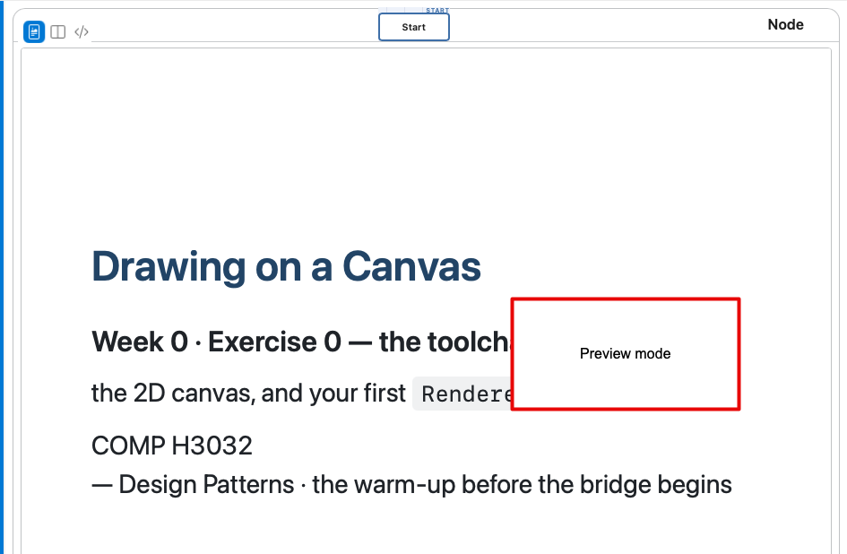
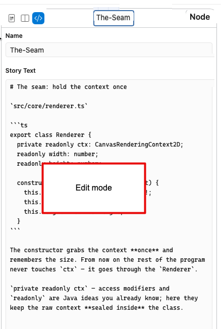

# version 5

## slide list - slide properties  vertical slider

when in slide sequence list mode, allow the slide properties panel to take up much more width 
(at the moment it seems to be limited to 50% of the webview)

e.g. allow the vertical slider to be moved 80% to the left, to maximise edit/preview mode for a slide

### preview/mixed/edit mode icons

put the 3 preview/mixed/edit mode icons at the top-left of the proeprties right-hand section of the webview

see screenshot designs

 
 - slide name appears like a node at top middle of properties right-hand section
 - the preview should SCALE TO FIT the availale width of this properties area

 
 
