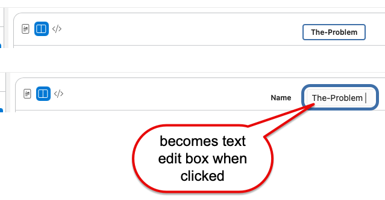

# version 9

## gain vertical space - move node name editing into title bar

to edit node name, user clicks node name in title bar\
- they they get text edit box

see 

so there is no longer a need for "Name" and the node name text edit box in the markdown editing area for a node
- saving some vertical space 